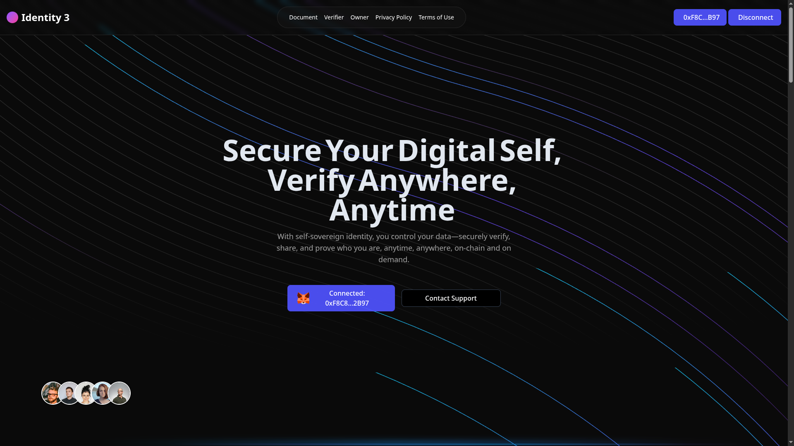
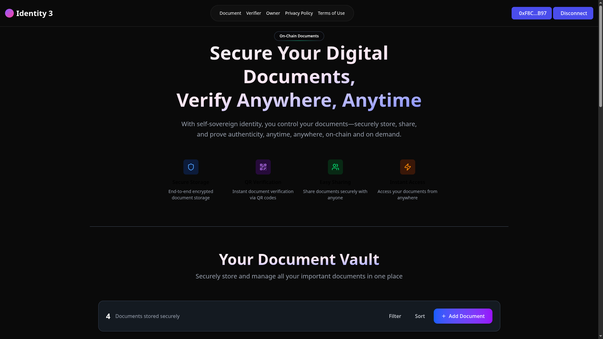
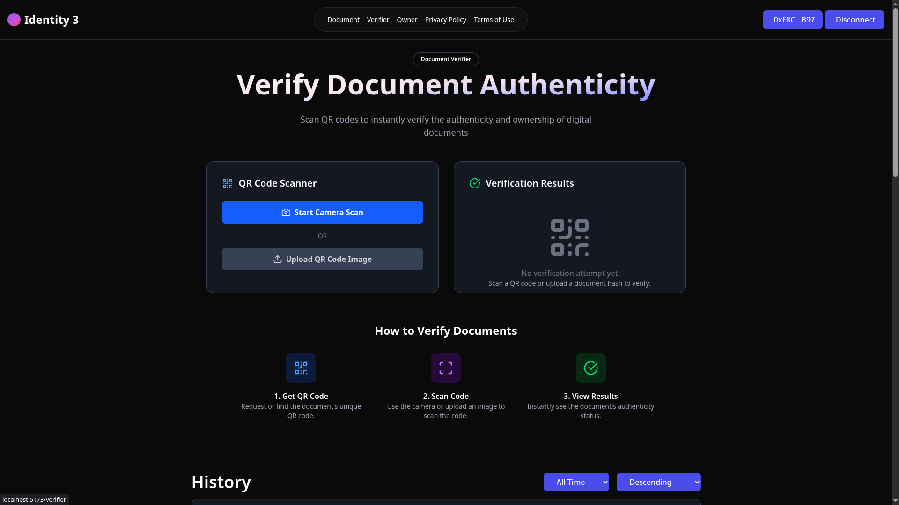
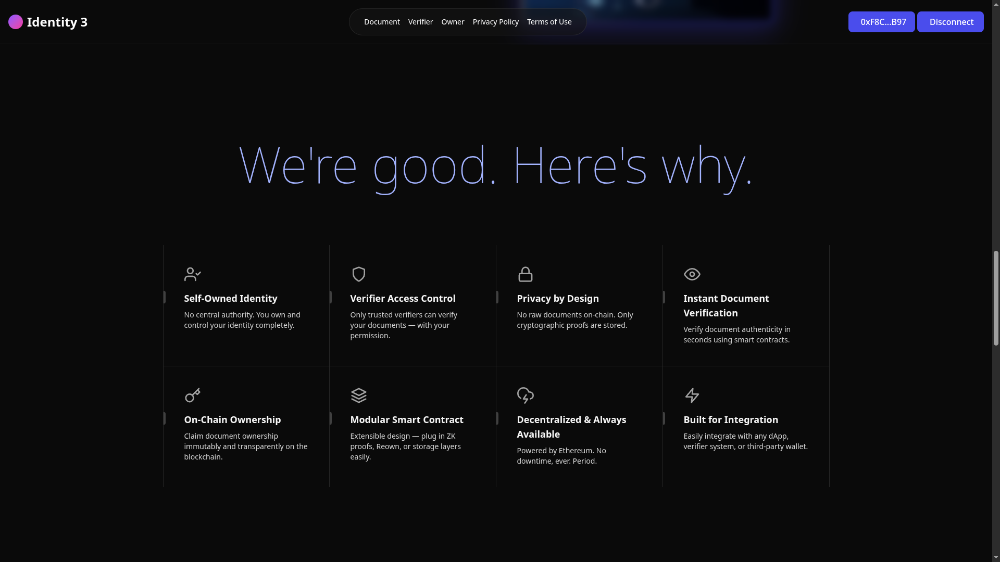

# Self-Sovereign Identity Verification System (Blockchain-based)

🚀 **An innovative and creative approach to digital identity verification!** 🚀

A groundbreaking decentralized identity verification system built on zkSync Era. This project introduces a **revolutionary new concept** where users upload documents from their own devices to prove identity, while verifiers can scan a QR code to validate the data — all without relying on any central authority.

💡 **What makes this different?** Unlike traditional identity systems, our system puts **YOU in complete control** of your identity data while maintaining cryptographic proof through innovative SHA3-256 on-chain hashing.

## 📸 Application Screenshots

| Dark | About |
|-----------|---------|
|  |  |

| Services | Projects |
|-----------|---------|
|  |  |

## 🚀 Current Status

✅ **Sepolia Testnet** - Fully functional deployment and testing completed  
✅ **zkSync Era Ready** - Code written and optimized for L2, final testing in progress  
🔄 **Ethereum Mainnet** - Production deployment coming very soon  
🔄 **Mobile App** - React Native version in active development  

## 🔐 Key Features

- **🌟 Revolutionary Self-Sovereign Identity**: Users own and control their identity data completely
- **🔗 Innovative QR Code Verification**: Scan to access verification data directly from blockchain
- **🛡️ SHA3-256 On-chain Hashing**: Military-grade cryptographic document integrity
- **📋 On-chain Verifier Registry**: Verifier details stored directly on blockchain
- **👑 Owner-Controlled Access**: Smart contract manages verifier permissions

## 🧱 Tech Stack

**Smart Contracts**: Solidity on zkSync Era & Ethereum, Foundry  
**Frontend**: React 19, Vite, Tailwind CSS, ethers.js v6  
**Storage**: SHA3-256 hashes on-chain, IPFS/Arweave integration planned  

## 🛠️ Quick Setup

1. **Clone & Install**:
   ```bash
   git clone https://github.com/yourusername/self-sovereign-id.git
   cd self-sovereign-id && cd frontend && npm install
   ```

2. **Build Contracts**:
   ```bash
   forge build && forge test
   ```

3. **Deploy & Run**:
   ```bash
   # Deploy to Sepolia
   forge script script/Deploy.s.sol:DeployScript --rpc-url <RPC_URL> --private-key <KEY> --broadcast
   
   # Run frontend
   npm run dev
   ```

## 👥 How It Works

**🧑 Users**: Connect wallet → Upload document → Generate SHA3-256 hash → Create QR code  
**🕵️ Verifiers**: Scan QR code → Access on-chain verification data → Verify document authenticity  
**👑 Owner**: Add/remove authorized verifiers → Manage decentralized network  

## 🗺️ Roadmap

**Phase 1 (Current)** ✅ Sepolia deployed, zkSync Era testing  
**Phase 2 (Next 4 weeks)** 🔄 Ethereum mainnet, IPFS integration, Mobile app  
**Phase 3 (Future)** 📋 zk-SNARKs, Multi-chain support, Enterprise APIs  

## 💡 What Makes This Special?

🎯 **Creative Innovation**: Completely new approach to digital identity  
🏗️ **Original Architecture**: Unique combination of self-sovereign identity + on-chain verification  
🚀 **Real Impact**: Actually working on testnet, ready for production  

## 📜 License

This project is licensed under the MIT License - see the [LICENSE](LICENSE) file for details.

## 📧 Contact

**Creator**: rkgofficial02340@gmail.com

💬 Interested in this innovative project? Reach out for collaborations!

---

**This is a creative and innovative project representing a new paradigm in digital identity verification. Join us in building the future!** 🚀